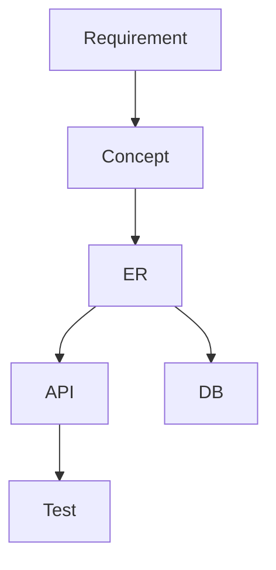

作れます。ネタは十分あります。

これは普通のnote記事より、**「架空論文っぽい顔をした実務エッセイ」**にすると面白いです。

ガチ論文ではなく、論文構成を借りた読み物。

# 論文調プロット案

## タイトル

**トークン経済工学：AI時代における推論資源と認知資源の配分設計**

## 副題候補

- LLM活用における人間レビューコスト、認知負荷、手戻りリスクの統合的評価
- AI活用を「料金最適化」ではなく「工程資源配分」として捉える試み
- 高性能モデル、軽量モデル、人間判断をどう配置するべきか

---

# 要旨

近年、LLMの業務利用において、トークン消費量やAPI利用料の最適化が注目されている。しかし、実務上のAI活用コストは、LLMの入出力トークン量のみでは評価できない。AI出力を人間が確認し、修正し、再判断し、場合によっては設計の手戻りを引き起こすためである。

本稿では、LLM利用に伴うコストを、単なるAPI料金ではなく、人間の認知負荷、レビュー工数、修正工数、手戻りリスクを含む工程全体の資源配分問題として捉える。この考え方を「トークン経済工学」と呼ぶ。

トークン経済工学では、高性能モデル、軽量モデル、人間判断、ドキュメント、ID体系、Skill分割、レビュー工程を、単独の部品ではなく一つの処理系として扱う。特に、上流設計においては、AIに判断を委譲するのではなく、人間が定義した評価軸・フィルター・業務モデルをAIに適用させることが重要である。

結論として、AI活用の成否は「どのモデルが賢いか」ではなく、「どの工程に、どの推論資源を、どの粒度で配置するか」によって決まる。

---

# 1. はじめに

## 1.1 背景

LLMの普及により、業務における文章生成、要約、比較表作成、コード生成、テスト作成は急速に自動化されつつある。

一方で、LLMを実務に投入すると、次のような問題が発生する。

- 出力確認に時間がかかる
- 一見正しそうだが、設計軸から外れた回答が出る
- 軽量モデルで節約したつもりが、人間の修正工数が増える
- 高性能モデルを使いすぎると費用が増える
- 長いコンテキストを投入すると、費用だけでなく文脈汚染も増える
- AIが評価軸を勝手に変更する
- 人間の判断密度が上がり、疲労が増える

従来の「AIコスト」は、多くの場合API料金やトークン量で語られる。しかし、実務において本当に高いのは、必ずしもトークンではない。

**人間の認知負荷である。**

---

# 2. 問題提起

## 2.1 API料金だけではAI活用コストを評価できない

LLM利用料は観測しやすい。

入力トークン、出力トークン、モデル単価を掛ければ計算できる。

しかし、実務上は以下のコストも発生する。

```
総コスト =
LLM利用料
+ 人間レビュー工数
+ 人間修正工数
+ 再判断コスト
+ 手戻りコスト
+ 認知負荷
```

API料金だけを最小化すると、しばしば全体コストは増える。

例えば、軽量モデルを使って1回あたりのコストを下げても、出力の軸ズレや誤解が増えれば、人間のレビュー・修正コストが増加する。

したがって、AI活用では「安いモデルを使う」ことではなく、**工程全体の総コストを下げること**が目的となる。

---

# 3. 定義：トークン経済工学

## 3.1 定義

本稿では、トークン経済工学を次のように定義する。

> **トークン経済工学とは、LLMの推論資源と人間の認知資源を、工程全体で最適配分するための設計技術である。**
> 

ここでいう「トークン」は、単なる課金単位ではない。

- 推論能力
- 文脈保持能力
- 注意資源
- レビュー対象
- 判断負荷
- 再計算対象

を含む、広義の処理資源として扱う。

## 3.2 対象とする資源

| 資源 | 内容 |
| --- | --- |
| 高性能LLM | 複雑な判断補助、設計レビュー、矛盾検出 |
| 軽量LLM | 整形、抽出、表変換、定型チェック |
| 人間 | 評価軸定義、前提採否、最終判断 |
| ドキュメント | 思考キャッシュ、正本、参照情報 |
| ID体系 | 修正対象のアドレス、トレーサビリティ |
| Skill | 工程分割された処理単位 |
| レビュー | 品質保証、軸ズレ検出、最終承認 |

---

# 4. 基本原則

## 4.1 人間が評価軸を定義し、AIが適用する

AIは大量の候補を出せる。

しかし、候補を評価する軸をAIに任せると、工程が不安定になる。

上流設計では特に、

- 何を見るか
- 何を見ないか
- どの前提を採用するか
- どの観点を今回は捨てるか

を人間が決める必要がある。

原則：

> **フィルターは人間が定義する。AIは適用する。**
> 

## 4.2 AIに判断を委譲しない

AIに任せるべきものは、判断そのものではなく、判断の前処理である。

AIに任せるもの：

- 情報収集
- 抽出
- 整理
- 比較
- 候補生成
- 影響範囲洗い出し
- 矛盾検出
- レビュー対象の絞り込み

人間が握るもの：

- 評価軸
- 業務概念
- 管理対象
- 前提採否
- リスク受容
- 最終判断

## 4.3 軸保持率を評価する

LLMの性能評価では、回答精度やベンチマークスコアが注目されがちである。

しかし、工程部品としてLLMを使う場合、重要なのは「賢さ」だけではない。

重要な評価指標：

| 指標 | 意味 |
| --- | --- |
| 軸保持率 | 指定された観点から逸脱しない度合い |
| handoff率 | 次工程へ人間修正なしで渡せる割合 |
| 修正率 | 出力に対する人間修正量 |
| 再計算率 | 前提変更なしに同じ議論を繰り返す割合 |
| レビュー圧縮率 | レビュー対象をどれだけ絞れたか |
| ガードレール遵守率 | 指示された範囲を越えない度合い |

---

# 5. モデル配置戦略

## 5.1 高性能モデルを投入すべき工程

高性能モデルは高価である。

したがって、すべての工程で使うべきではない。

投入すべき工程：

- 前提整理
- 設計レビュー
- 業務ルールの矛盾検出
- 責務境界の確認
- 影響範囲分析
- 複数案のトレードオフ整理
- 人間の判断材料生成

高性能モデルは「作業者」ではなく、**レビューアまたは設計補助者**として使う。

## 5.2 軽量モデルに任せる工程

軽量モデルに任せるべきものは、判断を含まない定型処理である。

例：

- Markdown整形
- 表形式変換
- ID一覧抽出
- 見出し統一
- TSV/CSV化
- 誤字脱字候補抽出
- 指定形式への再配置
- 定型チェック

軽量モデルに判断を持たせると、安く見えて高くつく。

## 5.3 人間が担当すべき工程

人間が担当すべきものは、失敗時の手戻りコストが大きい判断である。

特に上流設計では、

- 管理対象の決定
- 業務モデルの確定
- ERの確定
- 評価軸の選択
- 前提の採否
- リスクの受容

をAIに委譲してはいけない。

---

# 6. 工程分割とSkill設計

## 6.1 Skillは単一責任にする

AIに大きな仕事を渡すと、評価軸が混線する。

したがって、Skillは以下の条件を満たすべきである。

- 入力が明確
- 出力が明確
- 見る観点が明確
- 見ない観点が明確
- 判断権限が明確
- 後工程へのhandoff形式が明確

例：

```
Skill: 業務責務レビュー

入力:
- 要求一覧
- 用語定義
- ER

見る観点:
- 生成責任
- 更新責任
- 承認責任
- 参照責任

見ない観点:
- API設計
- DB物理設計
- UI設計
- 将来構想

出力:
- 責務不明箇所
- 矛盾候補
- 人間判断が必要な論点
```

## 6.2 並列エージェントではなく直列パイプライン

複数AIを並列に動かす方式は、発散には強い。

しかし、上流設計の工程安定性には向かない場合がある。

理由：

- 結果統合が必要
- 評価軸が揺れる
- レビュー対象が増える
- コストが読みにくい
- 出力粒度が揃わない

そのため、実務工程では以下のような直列パイプラインが適する。

```
要求抽出
↓
用語照合
↓
業務ルール抽出
↓
ER照合
↓
矛盾検出
↓
レビュー対象圧縮
↓
人間判断
↓
成果物化
```

---

# 7. 情報圧縮設計

## 7.1 IDは認知負荷を下げる

ID体系は単なる管理番号ではない。

AIとのやり取りでは、修正対象を指定するアドレスである。

例：

```
TERM-012を参照
REQ-021と矛盾
ADR-003の前提で再評価
BR-008の業務ルールに違反
```

IDがあることで、自然言語の説明量を減らし、AIの誤解を減らせる。

## 7.2 Markdownは思考キャッシュである

Markdownは単なる文書形式ではない。

設計判断、前提、用語、構造を再利用可能な形で残すための思考キャッシュである。

## 7.3 Mermaidは思考のDSLである

Mermaidは図を描くためだけの道具ではない。

関係、方向、依存、状態遷移をテキストとして扱うためのDSLである。



このように、AIが読み取れる構造として設計を残せる。

---

# 8. 上流設計における適用例

## 8.1 ERをAIに委譲しない

ERはDB設計ではない。

業務モデルである。

したがって、ERの確定は人間が担当すべきである。

AIに任せてよいもの：

- ERに対する矛盾検出
- 要求とのトレーサビリティ確認
- DDL生成
- ORM生成
- CRUD生成
- テスト観点生成
- 影響範囲洗い出し

AIに任せないもの：

- 管理対象の決定
- エンティティ境界の確定
- 業務概念の採否
- 責務境界の決定
- ERそのものの最終判断

## 8.2 ERの手戻りは高コストである

ER変更の重さは、変更箇所数では測れない。

特に重い変更：

- 新しい管理対象の追加
- ライフサイクルの変更
- 責務主体の変更
- 業務概念の再定義
- 既存エンティティの意味変更

これは下流のAPI、DB、画面、テスト、帳票すべてに波及する。

したがって、トークン経済工学では、ER確定前の上流判断に高性能推論資源と人間認知資源を集中させる。

---

# 9. コストモデル

## 9.1 単純なモデル

```
TotalCost =
ModelCost
+ HumanReviewCost
+ HumanCorrectionCost
+ ReworkCost
+ CognitiveLoad
```

## 9.2 軽量モデルが高くつくケース

```
安いモデルを使う
↓
軸ズレが増える
↓
人間レビューが増える
↓
修正が増える
↓
判断疲労が増える
↓
総コストが上がる
```

## 9.3 高性能モデルが安くつくケース

```
高性能モデルを使う
↓
レビュー対象が圧縮される
↓
人間判断が減る
↓
手戻りが減る
↓
総コストが下がる
```

重要なのは、モデル単価ではなく、**工程単位の総コスト**である。

---

# 10. 評価指標

トークン経済工学では、以下のような指標を用いる。

| 指標 | 定義 |
| --- | --- |
| Handoff率 | AI出力が次工程に渡せる割合 |
| 修正率 | 人間が修正した出力量の割合 |
| 軸保持率 | 指定観点から逸脱しなかった割合 |
| 再計算率 | 同じ論点を再度考えた割合 |
| レビュー圧縮率 | 元の論点数に対して人間確認対象が減った割合 |
| 手戻り影響度 | 変更が下流へ波及する範囲 |
| 認知負荷密度 | 単位時間あたりの人間判断数 |
| ガードレール逸脱率 | 禁止観点へ踏み込んだ割合 |

---

# 11. 考察

## 11.1 AI活用はプロンプト技術ではなく工程設計である

AIを単発の回答生成器として使う場合、プロンプトが重要になる。

しかし、実務工程へ組み込む場合、重要なのはプロンプト単体ではない。

- どの工程にAIを入れるか
- どこで人間が判断するか
- 何を正本にするか
- どの情報を圧縮するか
- どこでレビューするか
- 何を軽量モデルに落とすか
- 何を高性能モデルに任せるか

である。

つまり、AI活用の本質は**工程設計**である。

## 11.2 AIで楽になるのではなく、判断密度が上がる

AIは作業を減らす。

しかし、同時に候補・論点・比較対象を増やす。

その結果、人間は短時間で多くの判断を要求される。

したがって、AI活用の目的は単に作業時間を減らすことではなく、判断密度を制御することでもある。

## 11.3 高性能LLMは万能作業者ではなく、高価な推論資源である

高性能LLMは何でもできるように見える。

しかし、何でもさせると高くつく。

高性能LLMは、判断の前処理、複雑な矛盾検出、レビュー対象圧縮など、価値の高い工程に限定して使うべきである。

---

# 12. 結論

本稿では、LLMの業務利用をAPI料金の問題ではなく、推論資源と認知資源の配分問題として捉える「トークン経済工学」を提案した。

AI活用において重要なのは、トークンを節約することではない。

重要なのは、

- 高性能推論をどこに使うか
- 軽量処理をどこに使うか
- 人間判断をどこに残すか
- 情報をどう圧縮するか
- 手戻りをどこで防ぐか
- 認知負荷をどこで下げるか

である。

AIは人間の代わりに判断するものではない。

人間が判断できるよう、探索空間を圧縮するための工程部品である。

したがって、AI時代の開発工程に必要なのは、単なるAI活用術ではなく、

> **推論資源と認知資源を設計する技術**
> 

である。

これを本稿では、トークン経済工学と呼ぶ。

---

# 付録A：実務での設計チェックリスト

## A.1 モデル配置チェック

- この工程は判断を含むか
- 軸ズレした場合の修正コストは高いか
- 軽量モデルで十分か
- 高性能モデルを使う価値があるか
- 人間レビューはどこで入るか
- 出力は次工程へ渡せる形式か

## A.2 Skill設計チェック

- 入力は明確か
- 出力は明確か
- 見る観点は明確か
- 見ない観点は明確か
- 判断権限は明確か
- ガードレールは明文化されているか
- 逸脱時の扱いは決まっているか

## A.3 人間判断チェック

- この判断はAIに渡してよいか
- 前提が変わったら再判断が必要か
- 判断理由はADRに残っているか
- IDで参照可能か
- 後から説明可能か

## このプロットの面白いところ

これは**ふざけているようで、内容はかなり実務的**です。

普通なら「AIコスト最適化」で終わる話を、

> **人間の認知負荷まで含めた工程資源配分**
> 

に拡張している。

しかも、あなたの既存ネタが全部入ります。

| 既存ネタ | 論文調での位置づけ |
| --- | --- |
| AIは材料係 | 判断委譲ではなく判断前処理 |
| フィルターは人間 | 評価関数の人間保持 |
| 軸保持率 | 工程適合性指標 |
| handoff率 | 出力品質指標 |
| 修正率 | 人間介入コスト |
| ER = 業務 | 高手戻り領域の代表例 |
| ID体系 | 修正対象アドレス |
| Markdown | 思考キャッシュ |
| Mermaid | 構造DSL |
| 軽量モデル不信 | 局所最適による総コスト増 |
| 直列Skill | 工程資源配分 |

## さらに遊ぶなら

最後にこう書けます。

> なお、本稿は査読されていない。
> 
> 
> ただし、20年分の手戻りと認知負荷によって経験的に検証されている。
> 

これ、かなりあなたっぽいです。
