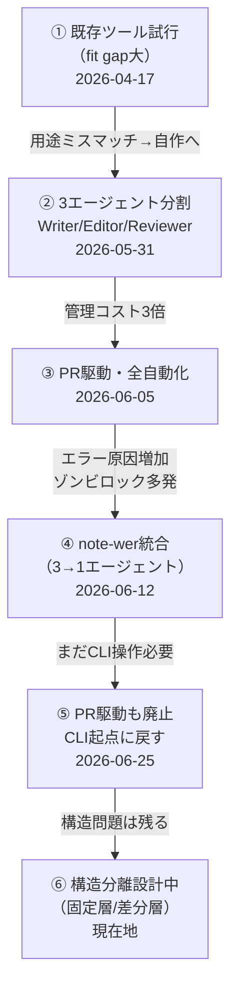

<!-- title: AIに任せたかった。でも品質と全自動は両立しなかった。 -->
<!-- banner: articles/wo-001_images/banner.png -->
<!-- body-start -->
# AIに任せたかった。でも品質と全自動は両立しなかった。

AIに記事を書かせたかった。ただそれだけで、始めた。

構成も、執筆も、推敲も、投稿も。全部 AI に任せて、自分はネタだけ出せばいい状態にしたかった。そのために、4月から試し続けた。

> **この記事はこんな人向け**
> ✅ AI で何かを自動化しようとして、途中で詰まった人
> ✅ Claude Code や ChatGPT を使い始めた初〜中級者
> ✅ 「任せたい」という気持ちと「でもうまくいかない」体験を持つ人

結論から先に書く。

## 先に結論

- 自動化しようとするたびに、手動作業が増えた
- Haiku にしたら品質が死んだ。Sonnet に戻したらコストが死んだ
- PR 駆動で全自動にしたら、管理が人間に戻ってきた
- 行き詰まりの正体は「全員が全部読む構造」だった
- 今も解決していない。でも、どこで詰まってるかはわかった

---

## 1. 最初にやったこと

handoff（手放し）が目的だった。「構成・執筆・推敲・投稿、全部 AI に任せたい」という話。

やり方はシンプルだった。

- 記事の指示書を作る
- AI に渡す
- 出てきたものを投稿する

最初の数記事は、それで動いた。品質が安定しなかったことを除けば。

---

## 2. 試すたびに、違う問題が出た

設計を変えるたびに、問題が変わった。解決したと思ったら、別の問題が出てくる。その繰り返しだった。

変遷をまとめると、こうなる。

GitHub に 2467 件のコミットが残っている。全部これをやった記録。

**① 既存ツール試行（2026-04-17）**

最初は multi-agent-shogun を試した。AI が AI に仕事を割り振る設計で、見た目は理想に近かった。でも用途が違った。汎用フレームワークを note 記事執筆に当てはめようとしたら、fit gap が大きすぎた。だから自作することにした。

**② 3エージェント分割（2026-05-31）**

Writer / Editor / Reviewer に分けた。「役割を分けたら品質が上がる」と思った。管理コストが 3 倍になった。全員が 5000 文字のペルソナ定義を毎回読んでいた。

**③ PR 駆動・全自動化（2026-06-05）**

GitHub の PR をトリガーに AI が自動で動く設計にした。CLI 操作ゼロを目指した。設定が複雑になり、エラーの原因が増えた。ゾンビロック（AI が止まって次が動けない）が多発した。

**④ note-wer 統合（2026-06-12）**

3 エージェントを 1 つに統合した。ガイドライン読み込みも 1 回に減らした。それでも「手放せた」感じはしなかった。コスト削減の問題ではなかった。

**⑤ PR 駆動も廃止（2026-06-25）**

全自動化を追求した結果、CLI に戻した。理由は一つ。CLI セッションが持つ情報を、GitHub Actions は持てない。agent が全ファイルを毎回読み直す旧設計に退行する。手動に戻した。ただし、より意図的な手動に。

---

## 3. Haiku にしたら、品質が死んだ

3 エージェントが全員、5000 文字のペルソナ定義を毎回読んでいた。

- トークンコストが爆増した
- 「Haiku にすれば安くなる」と思ってやったら、品質が死んだ
- Sonnet に戻したら今度はコストが死んだ
- 5 時間かけて、1 記事も完成しなかった

**安くしようとしたら品質が落ちた。品質を保とうとしたらコストが爆発した。**

これが、手離れできない判定の正体だった。

Haiku は安い。Sonnet は賢い。でも構造が「全員が全部読む」設計のままでは、どちらを選んでも詰む。モデルの問題ではなかった。

---

## 4. 行き詰まりの正体は「構造」だった

「全員が全部読む」設計が問題だった。

エージェントを増やしても、減らしても、ペルソナ定義を短くしても、「全員が同じ定義を全部読む構造」のままでは限界がある。

今やっていること。

- どの情報を固定で持ち、どれを毎回渡すかを分ける（固定層/差分層の分離）
- CLI が agent に必要な情報だけを渡す設計

他の自動化記事が「文体設定が甘かった」で止まるところで、この話は一段深いところに問題があった。

---

## おわりに

パイプラインの設計はこのあたりで収束させる。あとは細かい使い勝手の改善だけ。連載はしない。

結局、ずっと考えていたのは一つのことだった。「どこで人間が止めるか」。AI をどこに入れるかより、判断をどこに残すかの話。

そのあたりを別の角度から整理したのが[こちら](https://note.com/yuru_tech_log/n/n859777d342d8)。

参考になれば。

---
